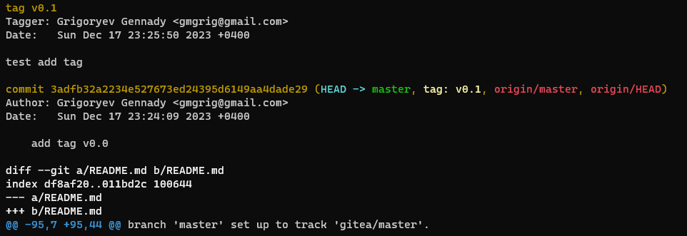
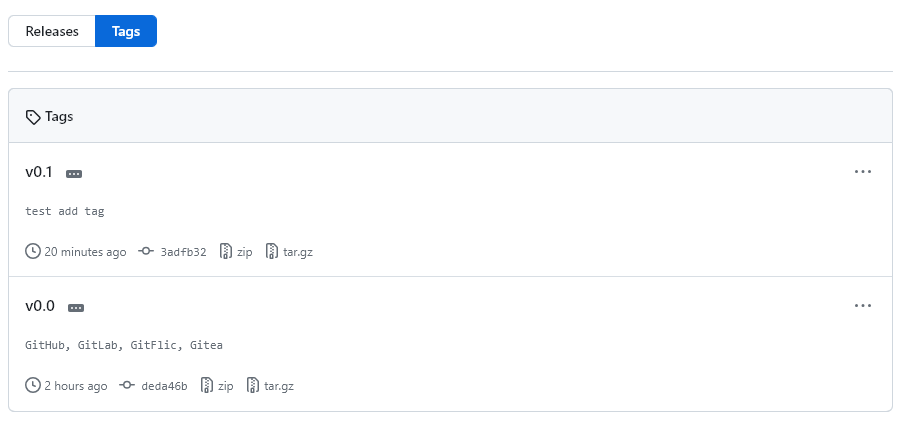

# Домашнее задание к занятию "Основы Git" - Григорьев Геннадий
---

### Задание 1

Никак не получалось зарегистрироваться на сервере GitLab. Задал вопрос в группе [Discord](https://discord.com/channels/967379343452033064/1184960088922918932) и с помощью @igorkomissarov удалось зарегистрироваться без подтверждения телефонного номера.

Создал пустой репозиторий и добавил его как дополнительный `remote`. Настроил ключ SSH.

```
> git remote -v
origin  https://github.com/GrigGM/devops-netology.git (fetch)
origin  https://github.com/GrigGM/devops-netology.git (push)

>git remote add gitlab git@gitlab.com:grigastra/devops-netology.git

>git push -u gitlab master
The authenticity of host 'gitlab.com (172.65.251.78)' can't be established.
ED25519 key fingerprint is SHA256:eUXGGm1YGsMAS7vkcx6JOJdOGHPem5gQp4taiCfCLB8.
This key is not known by any other names.
Are you sure you want to continue connecting (yes/no/[fingerprint])? yes
Warning: Permanently added 'gitlab.com' (ED25519) to the list of known hosts.
Enumerating objects: 31, done.
Counting objects: 100% (31/31), done.
Delta compression using up to 8 threads
Compressing objects: 100% (16/16), done.
Writing objects: 100% (31/31), 98.66 KiB | 8.22 MiB/s, done.
Total 31 (delta 8), reused 31 (delta 8), pack-reused 0
To gitlab.com:grigastra/devops-netology.git
 * [new branch]      master -> master
branch 'master' set up to track 'gitlab/master'.

> git remote -v
gitlab  git@gitlab.com:grigastra/devops-netology.git (fetch)
gitlab  git@gitlab.com:grigastra/devops-netology.git (push)
origin  https://github.com/GrigGM/devops-netology.git (fetch)
origin  https://github.com/GrigGM/devops-netology.git (push)
```

Вместо `Bitbucket` добавил `GitFlic` и `Gitea`

```
> git remote add gitflic https://gitflic.ru/project/gmgrig/devops-netology.git
> git remote add gitea https://gitea.com/Grig/devops-netology.git
> git remote -v
gitea   https://gitea.com/Grig/devops-netology.git (fetch)
gitea   https://gitea.com/Grig/devops-netology.git (push)
gitflic https://gitflic.ru/project/gmgrig/devops-netology.git (fetch)
gitflic https://gitflic.ru/project/gmgrig/devops-netology.git (push)
gitlab  git@gitlab.com:grigastra/devops-netology.git (fetch)
gitlab  git@gitlab.com:grigastra/devops-netology.git (push)
origin  https://github.com/GrigGM/devops-netology.git (fetch)
origin  https://github.com/GrigGM/devops-netology.git (push)
```

и сделал `push`

```
> git push -u gitlab master
Everything up-to-date
branch 'master' set up to track 'gitlab/master'.

> git push -u origin master
Everything up-to-date
branch 'master' set up to track 'origin/master'.

> git push -u gitflic master
Enumerating objects: 5, done.
Counting objects: 100% (5/5), done.
Delta compression using up to 8 threads
Compressing objects: 100% (3/3), done.
Writing objects: 100% (3/3), 279 bytes | 279.00 KiB/s, done.
Total 3 (delta 2), reused 0 (delta 0), pack-reused 0
remote: Resolving deltas: 100% (2/2)
remote: Updating references: 100% (1/1)
To https://gitflic.ru/project/gmgrig/devops-netology.git
   0aa01c5..fbd71e3  master -> master
branch 'master' set up to track 'gitflic/master'.

> git push -u gitea master
Enumerating objects: 5, done.
Counting objects: 100% (5/5), done.
Delta compression using up to 8 threads
Compressing objects: 100% (3/3), done.
Writing objects: 100% (3/3), 279 bytes | 279.00 KiB/s, done.
Total 3 (delta 2), reused 0 (delta 0), pack-reused 0
remote: . Processing 1 references
remote: Processed 1 references in total
To https://gitea.com/Grig/devops-netology.git
   0aa01c5..fbd71e3  master -> master
branch 'master' set up to track 'gitea/master'.
```

---

### Задание 2

Текущее состояние
```
> git log --oneline
deda46b (HEAD -> master, origin/master, origin/HEAD, gitlab/master, gitflic/master, gitea/master) GitHub, GitLab, GitFlic, Gitea
fbd71e3 hw
0aa01c5 GitHub
259b431 final
d6cd774 Moved and deleted
282757f Prepare to delete and move
858969f Added gitignore
a62c4bd First commit
e727dfb add README
```
Создадим легковесный тег v0.0 на HEAD-коммите и запушим его
```
> git tag
> git tag v0.0
> git tag
v0.0
> git log --oneline
deda46b (HEAD -> master, tag: v0.0, origin/master, origin/HEAD, gitlab/master, gitflic/master, gitea/master) GitHub, GitLab, GitFlic, Gitea
fbd71e3 hw
0aa01c5 GitHub
259b431 final
d6cd774 Moved and deleted
282757f Prepare to delete and move
858969f Added gitignore
a62c4bd First commit
e727dfb add README
``` 
```
> git push origin
Everything up-to-date
> git push origin --tags
Total 0 (delta 0), reused 0 (delta 0), pack-reused 0
To https://github.com/GrigGM/devops-netology.git
 * [new tag]         v0.0 -> v0.0
```

Добавил коммит для наглядности и создал аннотированный тег `v0.1`

```
> git log --oneline
3adfb32 (HEAD -> master, origin/master, origin/HEAD) add tag v0.0
deda46b (tag: v0.0, gitlab/master, gitflic/master, gitea/master) GitHub, GitLab, GitFlic, Gitea
fbd71e3 hw
0aa01c5 GitHub
259b431 final
d6cd774 Moved and deleted
282757f Prepare to delete and move
858969f Added gitignore
a62c4bd First commit
e727dfb add README
> git tag -a v0.1 -m "test add tag"
> git log --oneline
3adfb32 (HEAD -> master, tag: v0.1, origin/master, origin/HEAD) add tag v0.0
deda46b (tag: v0.0, gitlab/master, gitflic/master, gitea/master) GitHub, GitLab, GitFlic, Gitea
fbd71e3 hw
0aa01c5 GitHub
259b431 final
d6cd774 Moved and deleted
282757f Prepare to delete and move
858969f Added gitignore
a62c4bd First commit
e727dfb add README
```
`> git show v0.1`


Легковесные — это что-то очень похожее на ветку, которая не изменяется , — просто указатель на определённый коммит

Аннотированные — теги, которые хранятся в базе данных Git как полноценные объекты. Имеют контрольную сумму, содержат имя автора, его email и дату создания, имеют комментарий и могут быть подписаны и проверены с помощью GNU Privacy Guard (GPG)

Далее скриншоты со страниц разных репозиториев

`GitHub`




`GitLab`


`GitFlic`


`Gitea`


---

### Задание 3


---

### Задание 4

